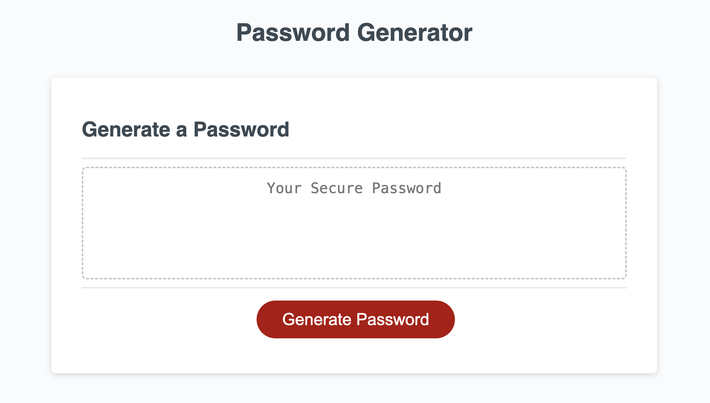
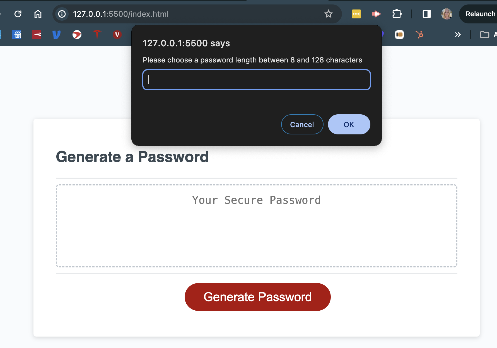
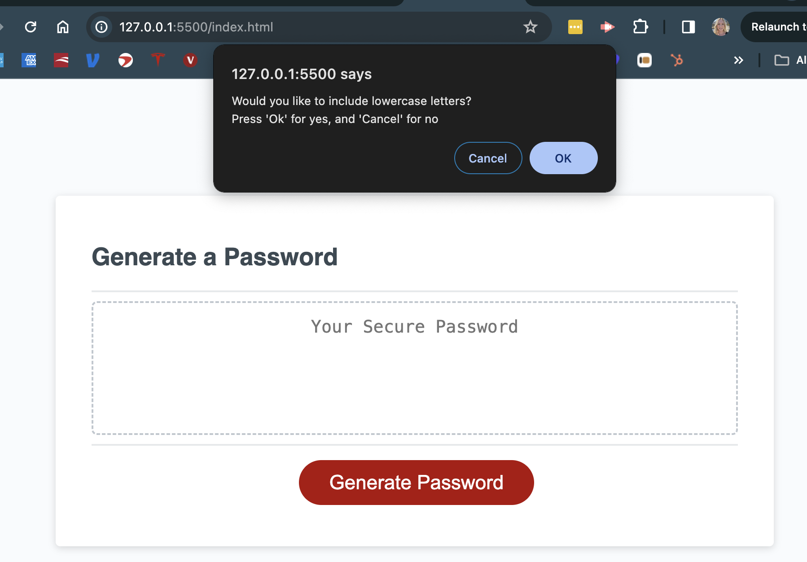
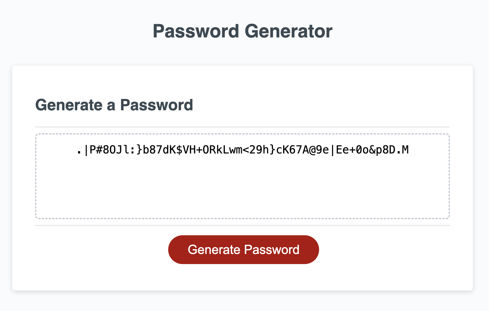

# Password Generator

## Description

I created a password generator that can give you a secure password which meets specific requirements for security (ie between 8-128 characters, and have a combination of uppercase, lowercase, special characters, and numbers). This way, hypothetical work apps are going to be more secure than if they were accesible via a re-used user password like 'Password123'.

## Installation

No installation necessary, simple access the website from any web-connected browser of your choosing. 

## Usage

To use the passwrod generator, you can use the visual cues below:

Screenshot of site

Press the 'generate password' button and enter length

Make selections for remainder options (uppercase, lowercase, special characters, numbers)

Then, you may copy your new password, and ideally, save it to your preferred password manager application for sake-keeping

## Credits

Big thanks to Sarun, and the three tutors from AskBCS who helped me with the javascript 

## License

MIT License

Copyright (c) [year] [fullname]

Permission is hereby granted, free of charge, to any person obtaining a copy
of this software and associated documentation files (the "Software"), to deal
in the Software without restriction, including without limitation the rights
to use, copy, modify, merge, publish, distribute, sublicense, and/or sell
copies of the Software, and to permit persons to whom the Software is
furnished to do so, subject to the following conditions:

The above copyright notice and this permission notice shall be included in all
copies or substantial portions of the Software.

THE SOFTWARE IS PROVIDED "AS IS", WITHOUT WARRANTY OF ANY KIND, EXPRESS OR
IMPLIED, INCLUDING BUT NOT LIMITED TO THE WARRANTIES OF MERCHANTABILITY,
FITNESS FOR A PARTICULAR PURPOSE AND NONINFRINGEMENT. IN NO EVENT SHALL THE
AUTHORS OR COPYRIGHT HOLDERS BE LIABLE FOR ANY CLAIM, DAMAGES OR OTHER
LIABILITY, WHETHER IN AN ACTION OF CONTRACT, TORT OR OTHERWISE, ARISING FROM,
OUT OF OR IN CONNECTION WITH THE SOFTWARE OR THE USE OR OTHER DEALINGS IN THE
SOFTWARE.