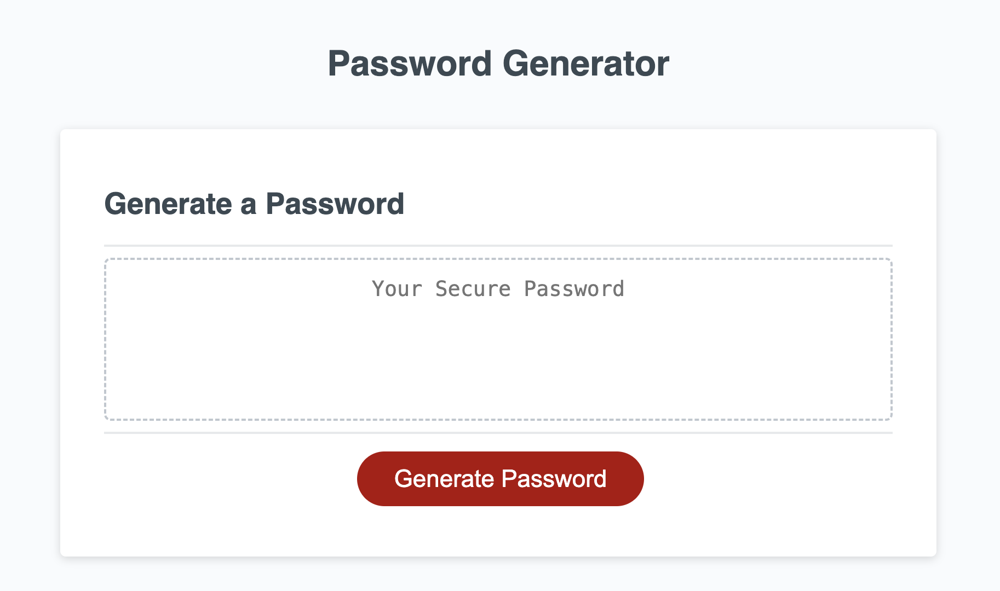
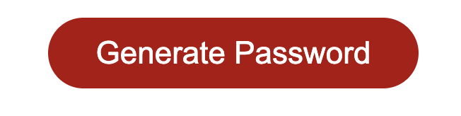
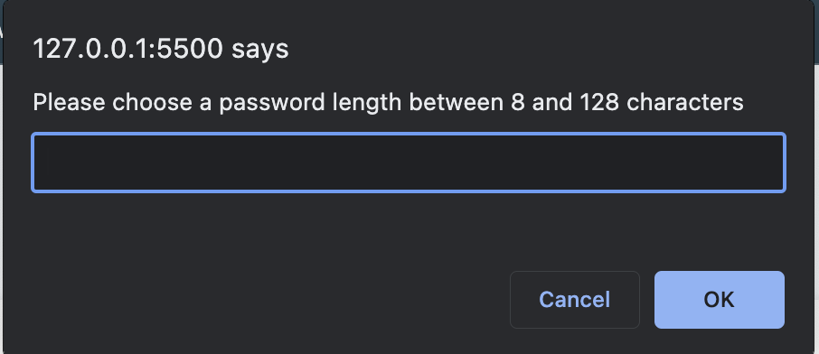

Week 3 Challenge: Password Generator

## Description

I created a password generator so that employees can meet password requirements and have secure passwords without being tempted to use an old familiar and insecure password for sensistive work applications. I learned a lot about javascript in general during this project. I'm still getting familiar with the language itself, and it's not very intuitive for me so far. Some things feel like they're written backwards, but in thinking about it as a literal new language like Spanish, that helped reassure me that I was doing things correctly. 

## Installation

No special steps required. Simply access the password generator via any browser which is connected to the internet.

## Usage

1. What you'll see on page load

2. Click 'Generate Password' button

3. Make selections and follow prompts

4. 

## Credits

Special thanks to Sarun Thunyapauksanon for offering to help throughout, and helping me stay on track.

Also need to say thank you to three separate tutors who helped me push the userOptions into that var so that I could apply math.floor to it to get my finalPassword.

## License

MIT License

Copyright (c) [year] [fullname]

Permission is hereby granted, free of charge, to any person obtaining a copy
of this software and associated documentation files (the "Software"), to deal
in the Software without restriction, including without limitation the rights
to use, copy, modify, merge, publish, distribute, sublicense, and/or sell
copies of the Software, and to permit persons to whom the Software is
furnished to do so, subject to the following conditions:

The above copyright notice and this permission notice shall be included in all
copies or substantial portions of the Software.

THE SOFTWARE IS PROVIDED "AS IS", WITHOUT WARRANTY OF ANY KIND, EXPRESS OR
IMPLIED, INCLUDING BUT NOT LIMITED TO THE WARRANTIES OF MERCHANTABILITY,
FITNESS FOR A PARTICULAR PURPOSE AND NONINFRINGEMENT. IN NO EVENT SHALL THE
AUTHORS OR COPYRIGHT HOLDERS BE LIABLE FOR ANY CLAIM, DAMAGES OR OTHER
LIABILITY, WHETHER IN AN ACTION OF CONTRACT, TORT OR OTHERWISE, ARISING FROM,
OUT OF OR IN CONNECTION WITH THE SOFTWARE OR THE USE OR OTHER DEALINGS IN THE
SOFTWARE.